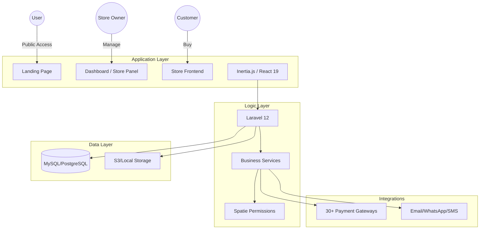
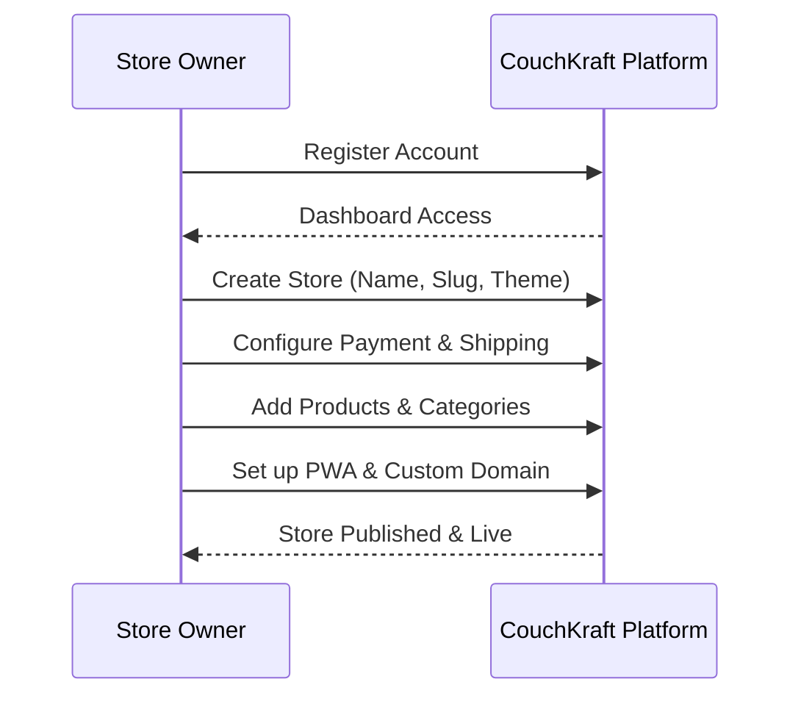
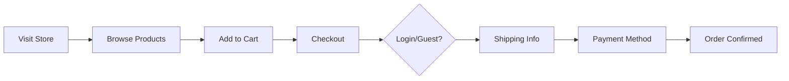
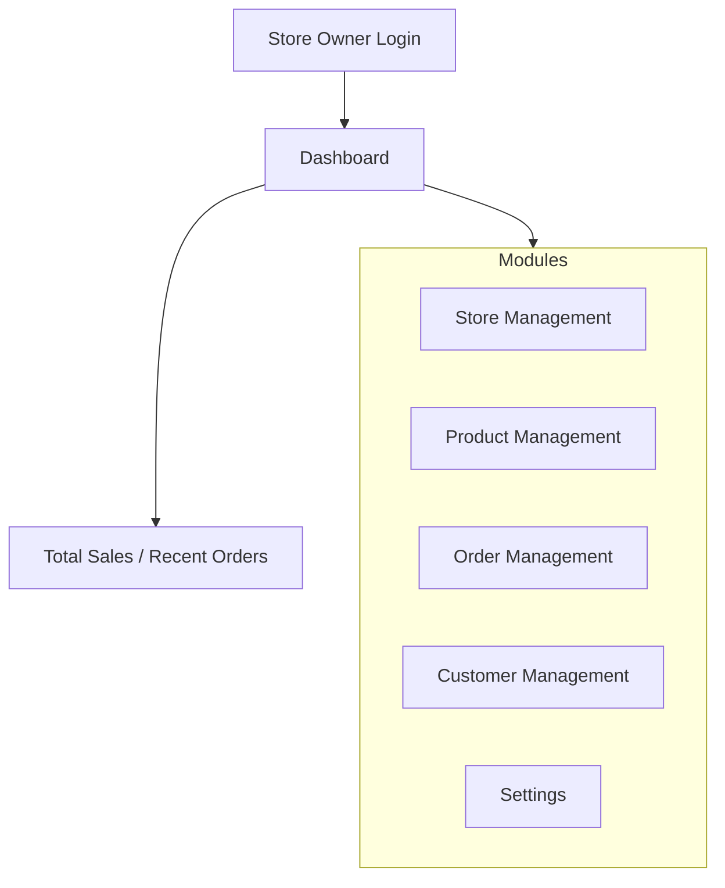
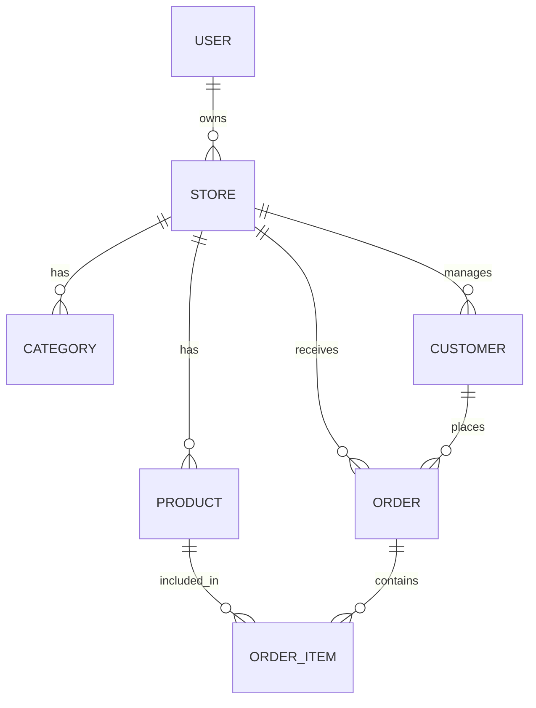
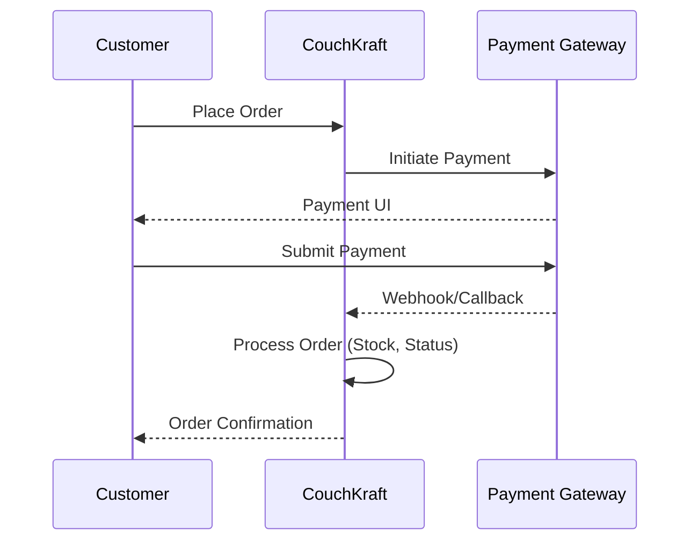
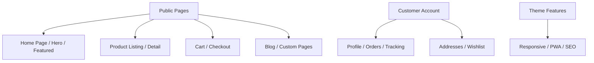
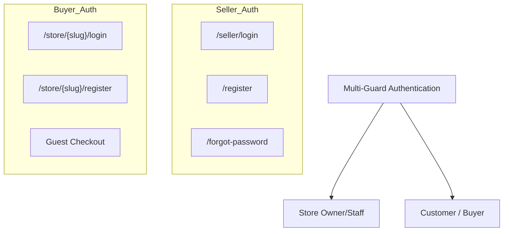
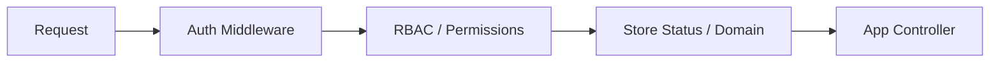

# Multi-Store E-Commerce Platform

## System Overview

A comprehensive multi-tenant e-commerce platform built with Laravel and React (Inertia.js) that enables users to create and manage multiple online stores with customizable themes, products, and payment integrations.

## Core Architecture

### Technology Stack
- **Backend**: Laravel 12 (PHP 8.2+)
- **Frontend**: React 19 with Inertia.js (TypeScript)
- **UI Framework**: Tailwind CSS 4, Radix UI, Lucide Icons
- **Database**: MySQL 8+ / PostgreSQL 15+
- **Cache/Queue**: Redis
- **Payment Gateways**: 30+ integrations (Stripe, PayPal, Razorpay, etc.)
- **Authentication**: Laravel Breeze + Multi-guard (Spatie Permissions)

### Key Features
- Multi-store management with custom domains/subdomains
- Role-based access control (RBAC) with Spatie Permissions
- Multiple payment gateway integrations
- PWA support for stores
- Multi-language support (i18next)
- Product management with variants and custom fields
- Order management with multiple payment methods
- Customer authentication and profiles
- Blog system for stores
- Coupon and discount management
- Tax and shipping configuration
- Analytics and reporting
- Email template customization
- Webhook support for integrations


## System Architecture Diagram




## User Workflow Diagram




## Customer (Buyer) Workflow Diagram



## Store Panel workflow Diagram




## Entity Relationship Overview




## Payment Flow Diagram




## Store Frontend Features




## Authentication System




## Key Middleware & Access Control




## API Endpoints

```
┌──────────────────────────────────────────────────────────────────────────
│                         PUBLIC API ENDPOINTS                             │
─”─────────────────────────────────────────────────────────────────────────┘

CART API
  ├──► GET    /api/cart                    - Get cart items
  ├──► POST   /api/cart/add                - Add item to cart
  ├──► PUT    /api/cart/{id}               - Update cart item
  ├──► DELETE /api/cart/{id}               - Remove cart item
  ─”──► POST   /api/cart/sync               - Sync cart (guest to user)

WISHLIST API
  ├──► GET    /api/wishlist                - Get wishlist items
  ├──► POST   /api/wishlist/add            - Add item to wishlist
  ├──► DELETE /api/wishlist/{id}           - Remove wishlist item
  ─”──► POST   /api/wishlist/toggle         - Toggle wishlist item

COUPON API
  ─”──► POST   /api/coupon/validate         - Validate coupon code

REVIEW API
  ├──► GET    /api/reviews                 - Get product reviews
  ─”──► POST   /api/reviews                 - Submit product review

NEWSLETTER API
  ─”──► POST   /api/newsletter/subscribe    - Subscribe to newsletter

LOCATION API
  ├──► GET    /api/locations/countries     - Get all countries
  ├──► GET    /api/locations/states/{id}   - Get states by country
  ─”──► GET    /api/locations/cities/{id}   - Get cities by state

```


## Notification System

```
┌──────────────────────────────────────────────────────────────────────────
│                      NOTIFICATION & COMMUNICATION                        │
─”─────────────────────────────────────────────────────────────────────────┘

EMAIL NOTIFICATIONS
  │
  ├──► Store Owner Notifications:
  │      ├──► New Order Received
  │      ─”──► Store Created
  │
  ─”──► Customer Notifications:
         ├──► Order Confirmation
         ├──► Order Status Update
         ├──► Shipping Notification
         ├──► Registration Welcome
         ─”──► Password Reset

WHATSAPP NOTIFICATIONS (Optional)
  │
  ─”──► Order Notifications:
         ├──► Order Placed
         ─”──► Order Status Update

SMS NOTIFICATIONS (Optional)
  │
  ─”──► Order Updates
         ─”──► Shipping Notifications

WEBHOOK SYSTEM
  │
  ├──► Event Triggers:
  │      ├──► Order Created
  │      ├──► Order Status Changed
  │      ├──► Product Created
  │      ├──► Customer Created
  │      ─”──► Store Created
  │
  ─”──► Webhook Configuration:
         ├──► Webhook URL
         ├──► Secret Key
         ├──► Event Selection
         ─”──► Retry Logic

EMAIL TEMPLATE SYSTEM
  │
  ├──► Customizable Templates
  ├──► Multi-language Support
  ├──► Variable Placeholders
  ─”──► Preview & Test

```


## Key Features Summary

### For Store Owners (Company Users)

✅ **Multi-Store Management**
- Create and manage multiple online stores
- Custom domains and subdomains
- Store-specific themes and branding

✅ **Product Management**
- Unlimited product variations
- Custom fields and attributes
- Bulk import/export
- Inventory tracking
- Downloadable products

✅ **Order Management**
- Complete order lifecycle management
- Multiple payment methods
- Order status tracking
- Invoice generation
- Email notifications

✅ **Customer Management**
- Customer profiles and history
- Customer groups
- Communication preferences
- Address management

✅ **Marketing Tools**
- Coupon and discount system
- Blog management
- Newsletter subscriptions
- SEO optimization

✅ **Analytics & Reports**
- Sales analytics
- Product performance
- Customer insights
- Revenue tracking
- Export capabilities

✅ **Customization**
- Multiple theme options
- Custom pages
- Email template customization
- Multi-language support

✅ **Payment Integration**
- 30+ payment gateways
- Multiple currencies
- Secure payment processing
- Webhook support

✅ **Shipping & Tax**
- Multiple shipping methods
- Zone-based shipping
- Tax configuration
- Automatic calculations

✅ **User Management**
- Role-based access control
- Staff management
- Permission system
- Activity tracking

✅ **PWA Support**
- Installable web apps
- Offline functionality
- Push notifications
- App-like experience


### For Customers (Buyers)

✅ **Shopping Experience**
- Browse products by category
- Advanced search and filters
- Product reviews and ratings
- Wishlist functionality
- Shopping cart

✅ **Checkout Process**
- Guest checkout option
- Multiple payment methods
- Address management
- Coupon application
- Order tracking

✅ **Account Management**
- Personal profile
- Order history
- Saved addresses
- Wishlist management
- Communication preferences

✅ **Mobile Experience**
- Responsive design
- PWA support
- Fast loading
- Touch-optimized

✅ **Content**
- Blog articles
- Custom pages
- Product information
- Store information

## Technology Highlights

### Backend
- **Laravel 12** - Modern PHP framework
- **Spatie Permissions** - Role-based access control
- **Spatie Media Library** - Media management
- **Laravel Queues** - Background job processing
- **Laravel Events** - Event-driven architecture

### Frontend
- **React 19** - Modern UI library
- **Inertia.js** - SPA without API
- **Tailwind CSS 4** - Utility-first CSS
- **Radix UI** - Accessible components
- **TipTap** - Rich text editor
- **Recharts** - Data visualization

### Payment Integrations
Stripe, PayPal, Razorpay, Cashfree, PayStack, Flutterwave, Mollie, PayTabs, CoinGate, Tap, Xendit, Iyzipay, Benefit, Ozow, Easebuzz, Khalti, Authorize.Net, FedaPay, PayHere, CinetPay, Nepalste, YooKassa, Aamarpay, Midtrans, PaymentWall, SSPay, MercadoPago, PayFast, ToyyibPay, PayTR, and more...

### Security
- CSRF protection
- XSS prevention
- SQL injection prevention
- Password hashing
- Email verification
- Rate limiting
- Secure session management


## Project Structure

```
├── app/
│   ├── Console/           # Artisan commands
│   ├── Events/            # Event classes
│   ├── Helpers/           # Helper functions
│   ├── Http/
│   │   ├── Controllers/   # Application controllers
│   │   │   ├── Api/       # API controllers
│   │   │   ├── Auth/      # Authentication controllers
│   │   │   ├── Store/     # Store frontend controllers
│   │   │   ─”── ...        # Other controllers
│   │   ├── Middleware/    # HTTP middleware
│   │   ─”── Requests/      # Form request validation
│   ├── Libraries/         # Third-party integrations
│   ├── Listeners/         # Event listeners
│   ├── Mail/              # Mail classes
│   ├── Models/            # Eloquent models
│   ─”── Observers/         # Model observers
│
├── database/
│   ├── factories/         # Model factories
│   ├── migrations/        # Database migrations
│   ─”── seeders/           # Database seeders
│
├── resources/
│   ├── js/                # React components
│   │   ├── Components/    # Reusable components
│   │   ├── Layouts/       # Layout components
│   │   ├── Pages/         # Page components
│   │   ─”── app.tsx        # Main React app
│   ├── css/               # Stylesheets
│   ─”── views/             # Blade templates
│
├── routes/
│   ├── web.php            # Web routes
│   ├── auth.php           # Authentication routes
│   ├── stores.php         # Store frontend routes
│   ─”── settings.php       # Settings routes
│
├── public/                # Public assets
├── storage/               # File storage
─”── tests/                 # Test files
```


## Common Workflows

### Creating a New Store

1. Store owner logs in to the platform
2. Navigates to Stores → Create New Store
3. Fills in store details (name, slug, theme, domain)
4. Configures payment gateways
5. Sets up shipping methods
6. Configures tax rules
7. Adds products and categories
8. Customizes store content
9. Publishes store

### Processing an Order

1. Customer browses products on store frontend
2. Adds products to cart
3. Proceeds to checkout
4. Enters shipping information
5. Selects payment method
6. Completes payment
7. Order is created in the system
8. Store owner receives notification
9. Store owner processes order
10. Updates order status
11. Customer receives status updates
12. Order is marked as delivered


## License

© Syed Hassan. All Rights Reserved.

## Version

Current Version: 1.0.0

---


